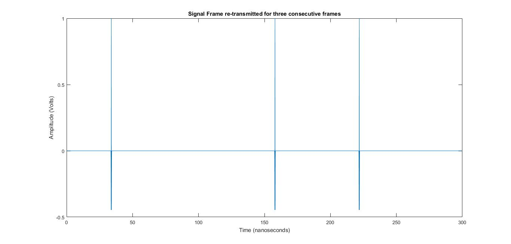

# Impulse-Radio-Time-Hopping-Transceiver
The code emulates the entire framework of Impulse Radio Time Hopping Ultra Wide Band Communication System. It consists of the Transmitter and Receiver code blocks. Reception is done with matched filtering technique.

Various channel impairments are added seperately and collectively.

I've sampled the results of this system at various stages of the communication chain process and placed right beneath the code.

Results are finally stored in a structure called "STORE" for later use.

## Essential Modules
### 1. Signal Frame Generate:
   
   This module controls the choice of whether to add the channel distortion and also the amount of distortion for various distances by virtue of *Pulse Distort Flag*. All essential parameters such as *sampling times, pulse, number of re-transmissions, distances*, etc., are set to vary according to needs by simply passing their values as arguments. 
### 2. Interferer Frame Generate:

   This module generates interference from varying sources at different distances. Provision is made available to transmit with a specific power level via *SIR_dB parameter*. *Pulse Distort Flag* feature is also provided. *Number of Interferers, their power levels, locations, signal distortion, anti-podal BPSK or pulse position PPM* can be set to the desired requirements.
   
   **Time asynchronism Flag** is added for re-producing more realistic results
Sample Outputs of the modules are re-produced below:

_**Desired Signal without Noise:**_ Signal Frame with frames re-transmitted for three times.

_**Interference:**_ A total of ten Interferers transmitting with equal power from varying distances: 

_**Composite Signal (Desired Signal + Interference):**_ The combined signal in the channel for three consecutive frames is displayed:

This repository is helpful to re-create the framework of signal transmission and reception and allows one to control and experiment with almost all system parameters.

Probability plots and Histograms for the distribution of various interesting parameters and many other results are provided in the code file. 
